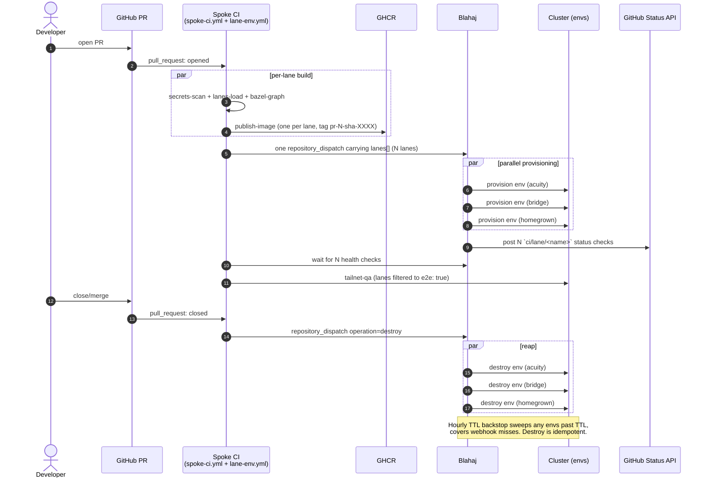
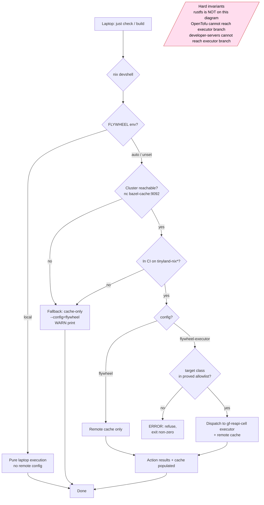

# CI-SCHEMA.md — Tinyland Spoke Site CI & Lane Contract

> **Status**: Normative. Every repository spawned from
> `tinyland-inc/site.scaffold` is governed by the contract in this
> document and the JSON Schemas under [`./schemas/`](./schemas/).
>
> **Companion artifacts:**
> - [`schemas/lanes.schema.json`](./schemas/lanes.schema.json) — the
>   `.github/lanes.json` shape every spoke ships.
> - [`schemas/blahaj-dispatch.schema.json`](./schemas/blahaj-dispatch.schema.json) —
>   the `repository_dispatch` payload sent to `tinyland-inc/blahaj`.
>
> **Read this first if** you are: spawning a new sister site, modifying
> the lane config, debugging a per-PR ephemeral env, onboarding a spoke
> to Flywheel RBE, or wiring `tinyland-inc/ci-templates` consumption.
>
> This document is the secondary overlay to [`../AGENTS.md`](../AGENTS.md).
> The two never contradict; `AGENTS.md` is the operating contract,
> `CI-SCHEMA.md` is the wire-format contract.

---

## 1. Purpose & non-goals

### In scope

| Surface | Authority |
|---|---|
| `.github/lanes.json` schema and lifecycle | This doc + [`lanes.schema.json`](./schemas/lanes.schema.json) |
| `repository_dispatch` payload to Blahaj | This doc + [`blahaj-dispatch.schema.json`](./schemas/blahaj-dispatch.schema.json) |
| `--config=flywheel` vs `--config=flywheel-executor` semantics | This doc §5 |
| Allowlist of proved REAPI target classes for spokes | This doc §5; mirrored from `tinyland-inc/GloriousFlywheel/config/rbe-target-eligibility.json` |
| Runner-class-to-job mapping for static spokes | This doc §6 |
| Per-PR ephemeral env DNS, image tag, TTL, state-namespace rules | This doc §7 |
| Required CI status checks and branch-protection ruleset name | This doc §8 |
| When laptops MAY / MUST run things locally | This doc §9 |
| `tinyland-inc/ci-templates` consumption (SemVer pin) | This doc §10 |
| Spoke-side conformance checklist | This doc §11 |

### Explicitly out of scope

- **Spoke runtime backends** — spokes have no app server, no DB, no auth
  at the edge. They are static projection consumers.
- **Payments, ActivityPub, HTTP signatures, public Fediverse federation** —
  these live in `tinyland.dev`, never in a spoke.
- **Promotion of rustfs to RBE state or CAS authority** — hard invariant.
- **Making OpenTofu RBE-eligible** — hard invariant.
- **Image publication policy** — `container-image-and-push` is blocked at
  the GloriousFlywheel manifest layer; spokes push via standard GHCR
  flows from cluster `tinyland-dind` runners.
- **The contents of `tinyland-inc/blahaj` itself** — this doc fixes the
  *wire* Blahaj receives, not its implementation.
- **Rules for `tinyland.dev` itself** — this doc governs spokes only.

---

## 2. The trunks+N model

A **lane** is a parallel configuration of the same commit. Every spoke
runs at least one lane (the default `main` lane); multi-trunk spokes
(e.g., the MassageIthaca acuity/bridge/homegrown pattern) declare N
lanes in `.github/lanes.json`.

### Lifecycle (PR-triggered lane)

```
PR opened/synchronized
  └─► spoke-ci.yml
        ├─► secrets-scan       (ubuntu-latest)
        ├─► lanes-load         (validate .github/lanes.json)
        ├─► flywheel-bazel-*   (per-lane matrix: build, test)
        └─► bazel-graph        (tinyland-nix-heavy)

PR opened/synchronized
  └─► lane-env.yml (spoke-lane-env.yml)
        ├─► lanes-load
        ├─► publish-image      (per-lane matrix, GHCR push)
        ├─► dispatch-apply     (one repository_dispatch carrying all N lanes)
        │     └─► Blahaj fans out → N envs provisioned in parallel
        │          └─► N `ci/lane/<name>` commit statuses posted on PR head SHA
        ├─► tailnet-qa         (per-lane matrix, filtered to e2e: true)
        └─► lane-status-check-finalize

PR closed (merged or not)
  └─► lane-env.yml on:[closed]
        └─► destroy-lanes      (one repository_dispatch, operation: destroy)
              └─► Blahaj reaps N envs idempotently

Hourly (scheduled-lane-reap.yml in ci-templates)
  └─► TTL backstop
        └─► Reap any PR env past its effective TTL
```

### Key contractual properties

1. **One image build per lane per commit.** Image is lane-agnostic
   unless the spoke's `lanes.json` sets `image_tag_template` with a
   `{LANE}` token.
2. **One dispatch carrying all lanes** — not N dispatches. This
   eliminates the MassageIthaca duplication bug where lane names were
   declared twice (once in `PR_ENV_TARGETS_JSON`, once inline in the
   dispatch `styles` array).
3. **Per-lane GitHub commit status checks** named `ci/lane/<name>`
   so branch protection can gate per-lane.
4. **Reap is idempotent.** Destroying an already-absent env is success.

---

## 3. `lanes.json` JSON Schema

Full schema: [`schemas/lanes.schema.json`](./schemas/lanes.schema.json).
Top-level shape (annotated):

```jsonc
{
  "schema_version": 1,                    // const; bumped on breaking changes
  "spoke": {
    "name": "site-scaffold",              // pattern: ^[a-z][a-z0-9-]{1,62}$
    "domain": "site.scaffold.tinyland.dev",
    "image_repository": "ghcr.io/<owner>/<name>"   // optional; default at workflow time
  },
  "defaults": {                           // optional; per-lane overrides win
    "runner_class": "tinyland-nix",
    "ttl_hours": 72,
    "image_tag_template": "pr-{PR_NUMBER}-sha-{COMMIT_SHA}",
    "trigger": "pull_request",
    "e2e": false,
    "flywheel_target_classes": []
  },
  "lanes": [                              // minItems 1, maxItems 8
    {
      "name": "default",                  // pattern: ^[a-z][a-z0-9-]{0,30}$
      "trigger": "pull_request",          // pull_request | merge_main | release_tag | manual
      "theme": "scaffold",                // brand theme key
      "snapshot_source": "checked-in",    // tinyland://pulse/m1, URL, or checked-in
      "runner_class": "tinyland-nix",     // optional override
      "e2e": false,
      "ttl_hours": 24,
      "tofu_state_suffix": "default",
      "image_tag_template": "...",
      "flywheel_target_classes": [...],
      "extra": { /* free-form, JSON-serializable, lane-scoped */ }
    }
  ]
}
```

### Example A — single-lane default spoke

This is the shipped template content. New sister sites start here.

```json
{
  "schema_version": 1,
  "spoke": {
    "name": "site-scaffold",
    "domain": "site.scaffold.tinyland.dev"
  },
  "defaults": {
    "runner_class": "tinyland-nix",
    "ttl_hours": 72,
    "flywheel_target_classes": ["sveltekit-app-build", "sveltekit-unit-tests"]
  },
  "lanes": [
    {
      "name": "default",
      "trigger": "pull_request",
      "theme": "scaffold",
      "snapshot_source": "checked-in",
      "e2e": false
    }
  ]
}
```

### Example B — three-lane MassageIthaca-shaped spoke

```json
{
  "schema_version": 1,
  "spoke": {
    "name": "massageithaca",
    "domain": "massageithaca.com"
  },
  "defaults": {
    "runner_class": "tinyland-nix",
    "ttl_hours": 72,
    "image_tag_template": "pr-{PR_NUMBER}-sha-{COMMIT_SHA}",
    "flywheel_target_classes": [
      "sveltekit-app-build",
      "sveltekit-unit-tests",
      "deployment-bundle-packaging"
    ]
  },
  "lanes": [
    {
      "name": "acuity",
      "trigger": "pull_request",
      "theme": "mi-default",
      "snapshot_source": "tinyland://pulse/m1",
      "e2e": false,
      "extra": { "style": "acuity-hosted", "selfServiceBooking": false }
    },
    {
      "name": "bridge",
      "trigger": "pull_request",
      "theme": "mi-default",
      "snapshot_source": "tinyland://pulse/m1",
      "e2e": true,
      "extra": { "style": "acuity-bridge", "selfServiceBooking": true }
    },
    {
      "name": "homegrown",
      "trigger": "pull_request",
      "theme": "mi-default",
      "snapshot_source": "tinyland://pulse/m1",
      "e2e": true,
      "extra": { "style": "homegrown", "selfServiceBooking": true }
    }
  ]
}
```

---

## 4. Blahaj dispatch payload schema

Full schema:
[`schemas/blahaj-dispatch.schema.json`](./schemas/blahaj-dispatch.schema.json).

The composite action `tinyland-inc/ci-templates/.github/actions/lane-dispatch`
MUST construct this payload from the spoke's `lanes.json`. The composite
action `lane-reap` MUST emit the same shape with `operation: "destroy"`.
Blahaj has exactly one handler per spoke event_type; the `operation`
field discriminates.

### Provision example

```json
{
  "event_type": "massageithaca-lane-env",
  "client_payload": {
    "schema_version": 1,
    "operation": "provision",
    "spoke": "massageithaca",
    "domain": "massageithaca.com",
    "pr_number": 312,
    "source_ref": "refs/pull/312/head",
    "commit_sha": "<full-40-char-commit-sha>",
    "image_ref": "ghcr.io/jesssullivan/massageithaca:pr-312-sha-<full-40-char-commit-sha>",
    "ttl_hours": 72,
    "tofu_state_prefix": "massageithaca/312",
    "lanes": [
      { "name": "acuity",    "fqdn": "pr-312-acuity.massageithaca.com",    "theme": "mi-default", "snapshot_source": "tinyland://pulse/m1", "e2e": false, "extra": { "style": "acuity-hosted",  "selfServiceBooking": false } },
      { "name": "bridge",    "fqdn": "pr-312-bridge.massageithaca.com",    "theme": "mi-default", "snapshot_source": "tinyland://pulse/m1", "e2e": true,  "extra": { "style": "acuity-bridge",  "selfServiceBooking": true  } },
      { "name": "homegrown", "fqdn": "pr-312-homegrown.massageithaca.com", "theme": "mi-default", "snapshot_source": "tinyland://pulse/m1", "e2e": true,  "extra": { "style": "homegrown",      "selfServiceBooking": true  } }
    ]
  }
}
```

### Destroy example

```json
{
  "event_type": "massageithaca-lane-env",
  "client_payload": {
    "schema_version": 1,
    "operation": "destroy",
    "spoke": "massageithaca",
    "pr_number": 312,
    "source_ref": "refs/pull/312/head",
    "commit_sha": "<full-40-char-commit-sha>",
    "image_ref": "expired-destroy",
    "ttl_hours": 1,
    "tofu_state_prefix": "massageithaca/312",
    "lanes": [
      { "name": "acuity",    "fqdn": "pr-312-acuity.massageithaca.com" },
      { "name": "bridge",    "fqdn": "pr-312-bridge.massageithaca.com" },
      { "name": "homegrown", "fqdn": "pr-312-homegrown.massageithaca.com" }
    ]
  }
}
```

---

## 5. Flywheel binding contract

Spokes opt into Flywheel along **two independent axes**:

| Config | Effect | Safe on |
|---|---|---|
| `--config=flywheel` | Remote *cache* only (`bazel-cache.nix-cache.svc.cluster.local:9092`). | Any cluster-reachable runner. |
| `--config=flywheel-executor` | Adds `--remote_executor=...`, the proved-class tag filter, and the worker platform pin. | **Cluster runners only.** Composite action `flywheel-bazel` MUST refuse this config on `ubuntu-latest`. |

### Proved-class allowlist for static spokes

Mirrored from
`tinyland-inc/GloriousFlywheel/config/rbe-target-eligibility.json` at
the tag this schema was cut against. The enum in
[`schemas/lanes.schema.json`](./schemas/lanes.schema.json) is the
authoritative gate; adding a class to a spoke's
`flywheel_target_classes` without a matching scaffold tag fails CI
schema validation.

| Target class | Status | `--config=flywheel-executor` allowed? |
|---|---|---|
| `sveltekit-app-build` | proved | ✅ |
| `sveltekit-unit-tests` | proved | ✅ |
| `deployment-bundle-packaging` | proved | ✅ |
| `docs-site-static-build` | proved | ✅ |
| `web-playwright-chromium-static-smoke` | candidate | ❌ — rejected at runtime until promoted |

### How to add a target class

1. PR to `tinyland-inc/GloriousFlywheel/config/rbe-target-eligibility.json`
   promoting a candidate to `proved`. Proof MUST cite:
   - default-branch `workflow_run` ID
   - artifact ID
   - `remote_processes > 0`
   - `worker_image_digest`
2. After merge, PR to `site.scaffold` bumping the enum in
   `lanes.schema.json` and adding a row to this table. Tag the next
   `site.scaffold` minor version.
3. Spokes adopt by bumping their `ci-templates` SemVer pin (§10) and
   editing `lanes.json.flywheel_target_classes`.

### Hard invariants (verbatim)

- Do **not** promote RustFS to RBE CAS / action-cache authority from
  this manifest or any spoke. State lives in env-owned S3-compatible
  buckets only.
- Do **not** make OpenTofu targets (`opentofu-validate`, `opentofu-fmt`)
  RBE-eligible. They are blocked at the manifest layer and MUST NOT
  appear in any spoke's `flywheel_target_classes`.
- Do **not** make developer-server targets (`//app:dev`) RBE-eligible.
  Devservers are interactive long-running local processes; remote
  execution proof requires bounded actions with declared outputs.
- State authority remains in env-owned S3-compatible buckets; the
  `tofu_state_prefix` rules in §7 are the only state-routing surface
  this schema controls.
- Spokes MUST NOT count remote cache hits, ARC runner dispatch, or
  GitHub-hosted execution as "RBE".

---

## 6. Runner class matrix

| Job | Default `runs-on` | Why | `--config=flywheel-executor`? |
|---|---|---|---|
| `secrets-scan` (gitleaks) | `ubuntu-latest` | Org-default; security-gating concern, runs before any cluster reachability is assumed. | no |
| `build-and-test` (`just check`, `just build`) | `tinyland-nix` | Canonical Nix devshell. | yes (proved classes only) |
| `bazel-graph` (`bazelisk mod graph`, `bazelisk build //:node_modules`) | `tinyland-nix-heavy` | Graph queries are memory-hungry. | yes (proved classes only) |
| `bazel-rbe-proof` (optional) | `tinyland-nix-heavy` | Dispatches/awaits GloriousFlywheel proof. | n/a (dispatcher only) |
| `publish-image` | `tinyland-dind` | Container build + push to GHCR. | no (`container-image-and-push` blocked) |
| `lane-qa` (waits for envs, runs E2E) | `tinyland-nix-kvm` | Needs tailnet join + Playwright. | candidate (`web-playwright-chromium-static-smoke`), gated |
| `dispatch-apply` / `dispatch-reap` | `ubuntu-latest` | Pure `gh api` calls; no cluster reachability needed. | n/a |
| `pulse-ingest` (snapshot refresh PRs) | `tinyland-nix` | Nix devshell. | no |

**Escape hatch rule:** `runs-on: ubuntu-latest` is permitted only for
jobs whose entire purpose is a `gh api` call, a webhook dispatch, or a
security gate that must execute before cluster trust is established.
Every other job MUST use a `tinyland-*` class.

---

## 7. Per-PR ephemeral env contract

### DNS naming

`pr-{PR_NUMBER}-{LANE}.<spoke.domain>` by default. Override at lane
level via `lanes[].domain` (full FQDN). The composite action
`lane-dispatch` computes this from `lanes.json`; workflows MUST NOT
hardcode lane URLs.

### Image tagging

`pr-{PR_NUMBER}-sha-{COMMIT_SHA}` (full SHA). Override via
`defaults.image_tag_template` or `lanes[].image_tag_template`. Tokens:
`{PR_NUMBER}`, `{COMMIT_SHA}`, `{LANE}`. The image is lane-agnostic by
default; if a spoke needs per-lane images, it includes `{LANE}` in the
template.

### TTL rules

- **Default**: `defaults.ttl_hours` (schema default 72).
- **Per-lane override**: `lanes[].ttl_hours`.
- **Per-PR override via label**: `lane-ttl/7d`, `lane-ttl/30d`,
  `lane-ttl/keep` raise the TTL for *that PR*. `lane-ttl/keep` pins to
  720h (the schema max) — no infinite TTLs.
- Labels that would *lower* the TTL are rejected by the `lane-dispatch`
  composite action. TTL is a floor for visibility, not a ceiling.

### Reap triggers

All three MUST be implemented in `tinyland-inc/ci-templates`:

1. `pull_request: closed` → immediate reap dispatch.
2. **TTL backstop**: a scheduled workflow (`scheduled-lane-reap.yml`,
   hourly) lists all PR envs and dispatches reap for any past TTL —
   covers GH webhook misses.
3. **Manual** `workflow_dispatch: lane-reap` accepting `pr_number`.

### Idempotency

Reap MUST be safe to run twice. Blahaj handlers MUST treat "env does
not exist" as success on a destroy. The `lane-dispatch` composite
MUST NOT fail if a previous reap already succeeded — it sends and
exits 0.

### State-namespace rules

S3 key prefix: `<spoke.name>/<pr_number>/<lane.tofu_state_suffix || lane.name>/`.

The `lane-dispatch` composite derives this and passes it as
`tofu_state_prefix` in the dispatch payload. Rustfs is forbidden
anywhere in this path — bucket targets are env-owned S3-compatible
only (e.g. Garage at `garage.nix-cache.svc.cluster.local`, MinIO, or
the cluster's primary S3-compatible store).

---

## 8. CI gate contract

### Required status checks

| Check | When required |
|---|---|
| `secrets-scan` | always |
| `build-and-test` | always |
| `bazel-graph` | always |
| `ci/lane/<name>` | one per entry in `lanes.json.lanes`, posted by Blahaj against the head SHA |
| `lane-qa` | when any lane has `e2e: true` |
| `bazel-rbe-proof` | when `flywheel_target_classes` is non-empty |

### Org-level ruleset

Branch protection ruleset name: **`tinyland-spoke-default`**. Source of
truth: `tinyland-inc/.github` (currently empty profile — seeding this
ruleset is a follow-up tracked in the implementation plan).

Spokes import the ruleset via the GitHub org UI or via Terraform
managed in `tinyland-infra`. Per-repo overlay: a spoke MAY add
additional checks but MUST NOT remove any from the default set without
an exception comment in its `AGENTS.md`.

---

## 9. `--local` escape-hatch contract

Reconciles the existing `nix develop`-first DX with cluster-first CI.

| Activity | `--local` allowed? | Required path |
|---|---|---|
| `just dev`, `just preview`, doc edits | yes | always local |
| `just check` (svelte-check + lint + unit) | yes | local or cluster; recipe accepts both |
| `just build` (artifact-producing) | yes for ad-hoc; **no** for any artifact that will be uploaded, deployed, or used as a release input | local OK for dev; cluster MUST for CI |
| `just bazel-graph`, `bazelisk build //:node_modules` | yes (laptop) for graph reading | cluster MUST for cache-uploading or executor-backed builds |
| `bazelisk build --config=flywheel-executor ...` | no | cluster-only (only `tinyland-nix*` reaches `gf-rbe.svc.cluster.local`) |
| Anything that mutates state (`tofu apply`, image push, snapshot publish) | no | cluster MUST |
| `just validate-static-projection`, `just pulse-ingest` (read-only) | yes | local or cluster |

### Recipe contract

Every Justfile recipe with a remote default MUST accept a `--local`
flag (or equivalent `LOCAL=1` / `FLYWHEEL=local` env). The shipped
Justfile in this scaffold honors this convention.

---

## 10. Versioning & evolution

### `ci-templates` consumption

Spokes reference reusable workflows as:

```yaml
uses: tinyland-inc/ci-templates/.github/workflows/spoke-ci.yml@v1.0.0
```

**Never `@main`.** `@main` is the develop branch and breaks without
notice; `@v1` is a floating tag for quick-start documentation only;
`@v1.0.0` is the immutable pin spokes should use. Renovate / Dependabot
tracks the pin.

### `lanes.json` schema versioning

Top-level `schema_version` (currently `1`). Breaking changes bump it;
migration notes go in `docs/CI-SCHEMA-CHANGELOG.md` (created when v2
ships). The scaffold ships a `just migrate-lanes` recipe for forward
migration at that time.

### Allowlist updates

Flow: GloriousFlywheel manifest PR → enum bump in `lanes.schema.json`
→ this scaffold tagged → spoke bumps `ci-templates` pin → spoke edits
its `lanes.json.flywheel_target_classes`. The allowlist enum is the
authoritative gate.

### This doc's tag

Every change to `CI-SCHEMA.md` bumps `site.scaffold`'s git tag. Spokes
consume a specific scaffold tag at template-instantiation time and may
stay on it; conformance is checked against the tag they were spawned
from until they explicitly upgrade.

---

## 11. Conformance checklist

A spoke is "house-style compliant" if all 12 items below pass.
`scripts/check-conformance.sh` (shipped in this scaffold) implements
the mechanical items.

- [ ] `.github/lanes.json` exists and validates against
  `lanes.schema.json` at the scaffold tag the repo was spawned from.
- [ ] `.github/workflows/ci.yml` references
  `tinyland-inc/ci-templates/.github/workflows/spoke-ci.yml` pinned by
  SemVer (not `@main`, not `@<sha>` longer than 30 days old without
  justification).
- [ ] Repo imports the org ruleset `tinyland-spoke-default`
  (verified via `gh api repos/{owner}/{repo}/rulesets`).
- [ ] Required status checks listed in §8 are all configured.
- [ ] `flywheel_target_classes` (if present) is a subset of the proved
  allowlist in §5.
- [ ] No `runs-on: ubuntu-latest` in jobs that touch state, build
  images, or run Bazel.
- [ ] `Justfile` exposes `--local` (or `LOCAL=1` / `FLYWHEEL=local`) on
  every artifact-producing recipe.
- [ ] No reference to `rustfs` for state or RBE CAS anywhere in
  `Justfile`, `tofu/`, or workflow YAML.
- [ ] No reference to OpenTofu targets in `flywheel_target_classes`.
- [ ] `spoke.image_repository` matches `ghcr.io/<repo-owner>/<spoke.name>`
  or is explicitly overridden with an in-file comment.
- [ ] Tailnet DNS for each lane resolves to a runner-reachable address.
- [ ] `AGENTS.md` cites the scaffold tag the repo conforms to.

---

## 12. Diagrams

### PR lifecycle across lanes



### Flywheel binding flow



---

## Cross-references

- [`../AGENTS.md`](../AGENTS.md) — operating contract; superordinate
  for repo posture rules. This doc is the wire-format complement.
- `tinyland-inc/GloriousFlywheel/config/rbe-target-eligibility.json` —
  upstream source of the proved-class allowlist.
- `tinyland-inc/ci-templates@v1.0.0` — the versioned reusable
  workflows and composite actions this contract assumes.
- `tinyland-inc/tinyland-infra/modules/spoke/*` — the five spoke-facing
  Tofu modules (`dns-pr-env`, `state-namespace`, `cache-quota`,
  `runner-binding`, `blahaj-app-install`) consumed by
  `tofu/main.tf`.
- `tinyland-inc/blahaj` — receiver of the `repository_dispatch`
  payload defined in §4. This doc fixes the wire; Blahaj owns the
  implementation.
- [`schemas/lanes.schema.json`](./schemas/lanes.schema.json),
  [`schemas/blahaj-dispatch.schema.json`](./schemas/blahaj-dispatch.schema.json)
  — companion JSON Schemas referenced throughout.
