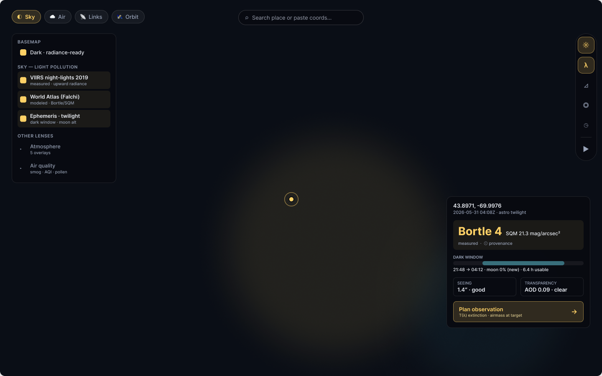
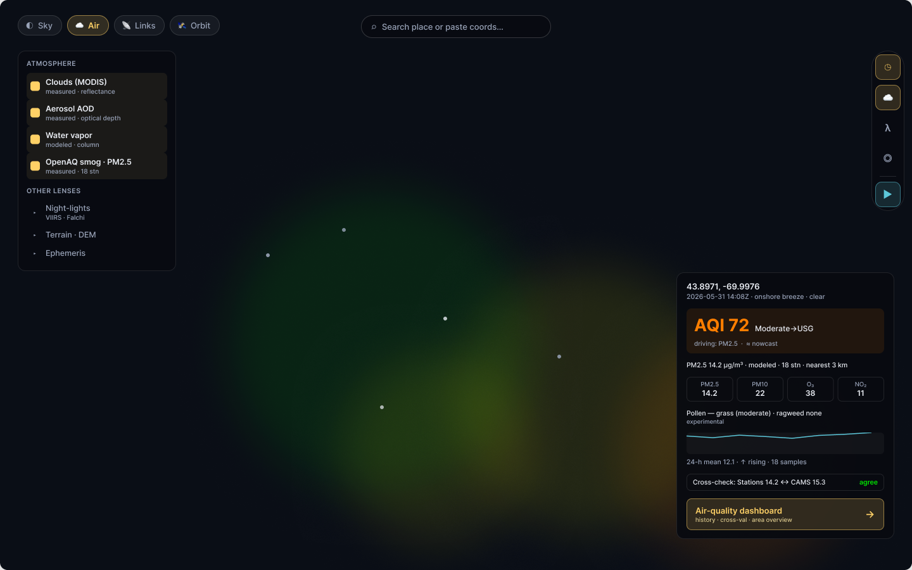
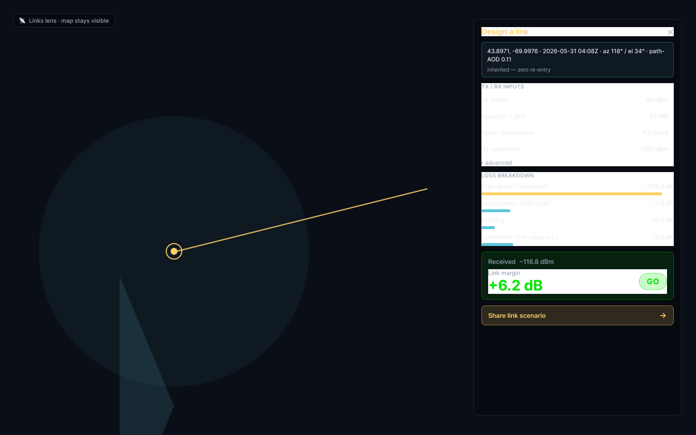
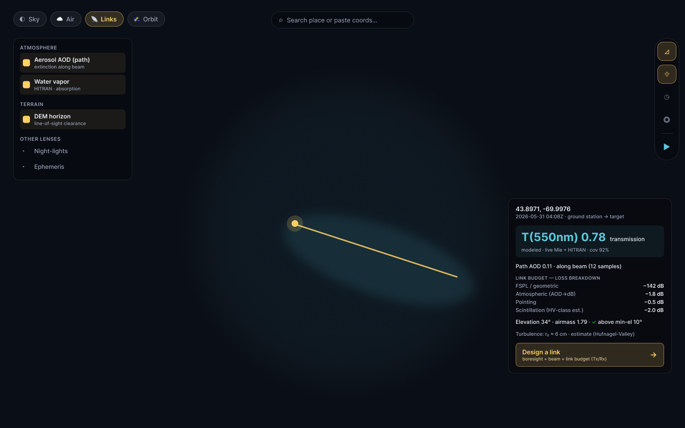
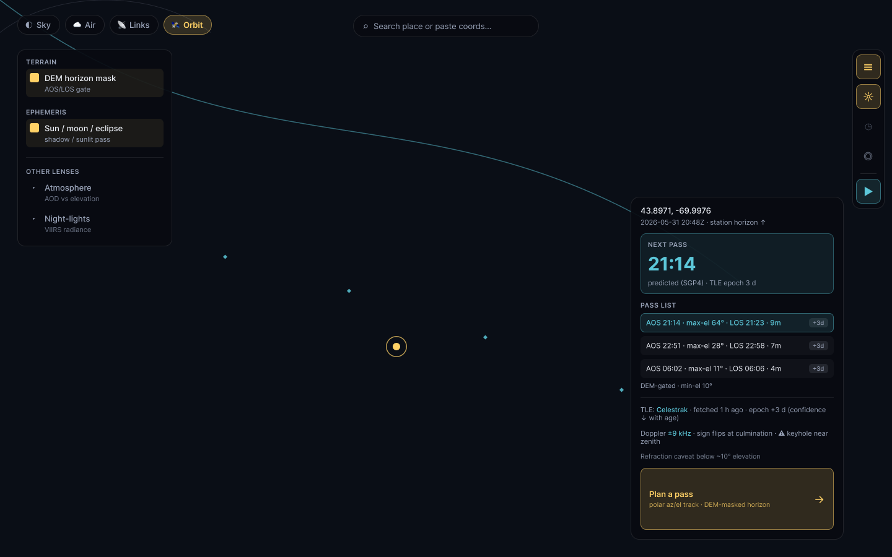
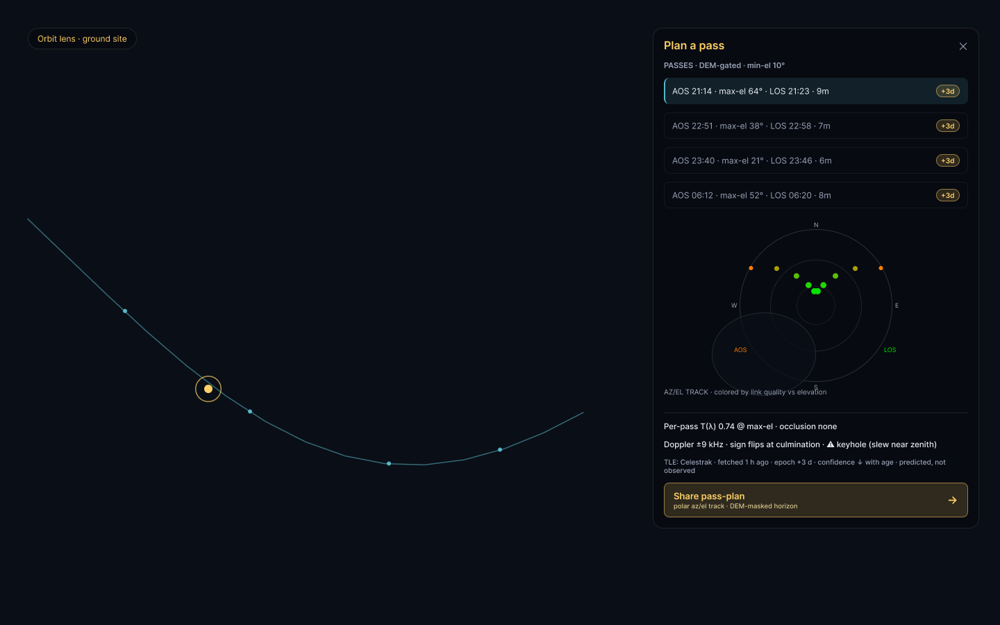
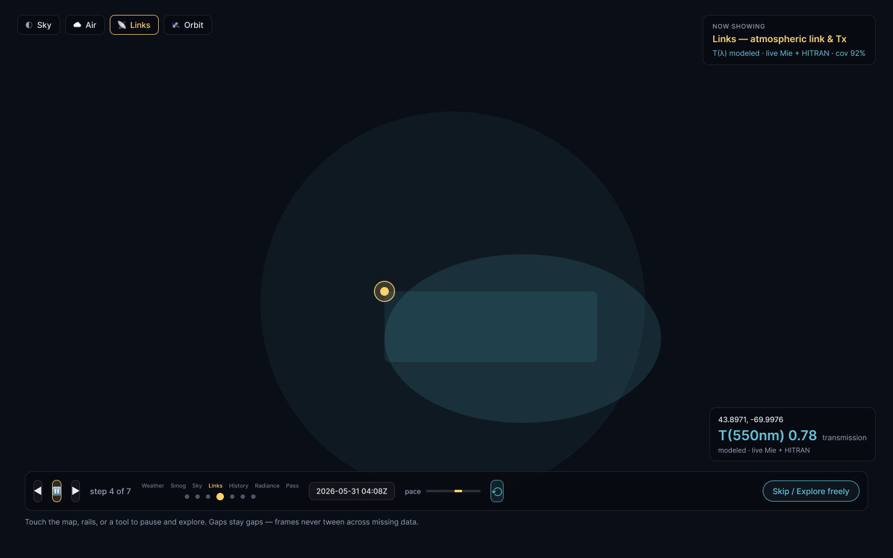

# darkmap — public-readiness packet

> **One map. Four lenses. Nothing hidden.**
> A presentation packet for the persona-lens model on `darkmap.phasi.space` —
> pairing the Phase-0 design frames with the shipped product and the UX
> principles that hold it together.

- **Thesis.** darkmap already carries deep, instrument-grade capability (light
  pollution, atmosphere, transmission, orbits). The persona **lenses** expose
  that depth for four audiences on the *same* shared map by **re-weighting**
  the interface — never by gating or forking it.
- **Status (2026-06-01).** Phase 0 design shipped (`docs/ux/personas-and-lenses.md`,
  PR #349). S1 lens engine shipped. Each lens's deep tool is live: Sky
  (observation planning), Air (AQ dashboard + on-map stations), Links
  (link-budget go/no-go), Orbit (DEM-gated pass planner).
- **Design source of truth.** Figma file
  [`DYMVqVYzHl8uehosEmWXdt`](https://www.figma.com/design/DYMVqVYzHl8uehosEmWXdt)
  — "darkmap — persona lenses, Phase 0". The frames below were exported from it
  (PNG, 1440×900) on 2026-06-01; see [Provenance](#provenance) to refresh.

---

## The four personas

| Lens | Audience | The question it answers | Shipped deep tool |
|---|---|---|---|
| ◐ **Sky** | Stargazers, astrophotographers | "How dark is it here, and when should I shoot?" | Observation planner + Bortle-led readout |
| ☁ **Air** | Public-health / air-quality watchers | "What am I breathing, and where are the stations?" | `/aq` dashboard + on-map PM2.5 stations |
| 📡 **Links** | FSO / laser-comms & RF link engineers | "Will this optical link close, here, now?" | Link-budget panel (go / marginal / no-go) |
| 🛰 **Orbit** | Satellite operators, amateur-radio ops | "When does it clear *my* ridgeline?" | DEM-gated SGP4 pass planner |

---

## The lens re-weight matrix

Every lens drives the *same* five derived surfaces. Switching a lens **reorders
and dims** them; it never adds, removes, or disables a capability.

| Lens | LayerRail leads | Readout lead | Primary CTA | Toolbar promotes | Basemap |
|---|---|---|---|---|---|
| ◐ Sky | Night-lights | **Bortle** headline (SQM beneath; provenance on `(i)`) | Plan observation | Ephemeris | Dark |
| ☁ Air | Atmosphere + **Smog (PM2.5) stations** | Driving pollutant + AQI (NowCast-labeled) | Air-quality dashboard | Time scrubber | neutral |
| 📡 Links | Atmosphere (path-AOD) + Terrain | T(λ) + path-AOD | Design a link | Beam-footprint | Dark |
| 🛰 Orbit | Terrain (DEM) + Ephemeris | Next DEM-gated pass + epoch-age | Plan a pass | Ephemeris | Dark |

---

## UX flow philosophy

Three commitments make the lenses legible and trustworthy:

1. **Re-weight, never gate.** A lens change **dims + reorders** (3-tier opacity:
   Tier-1 active headline/CTA, Tier-2 active-lens layers, Tier-3 off-lens ~0.55).
   Every Tier-3 element stays **keyboard-focusable and clickable** — no
   `display:none`, no `aria-disabled`, no removal. Off-lens capability is one
   tap away, never locked behind a mode. *(Enforced by the `lens-reweight`
   browser smoke: a Tab-through asserts nothing is gated.)*
2. **Two-channel tier signal.** Importance reads through **colour _and_ opacity
   _and_ weight + order** together — never colour alone — so the active lens is
   unambiguous regardless of vision or display.
3. **ColorVision-Assist.** Active state is a **filled pill + bold label**, not a
   hue swap; data palettes (e.g. the EPA AQI 6-band) ship an accessible variant.
   The lens diff cross-fades (~150–250ms) behind `prefers-reduced-motion`; the
   **map viewport is never animated**.

Honesty bar (the "V6" rule): every modeled or estimated value is **labeled** —
predicted-not-observed for SGP4 passes, "clear-sky estimate" for transmittance,
NowCast for AQI, provenance one tap away for Bortle. We never paint a model as a
measurement.

---

## Per-lens flow sheets

Each sheet pairs the lens's **map-state** frame (the shared map, re-weighted)
with its **deep-tool** surface, and notes the ≤1-tap drill rhythm.

### ◐ Sky — "How dark, and when?"

- **Lead:** a single **Bortle** headline (SQM beneath); modeled provenance lives
  on the `(i)`, not inline — the cleanest read for the most-asked question.
- **Layers:** night-lights family promoted; atmosphere/terrain dim to Tier-3.
- **Drill:** *Plan observation* → SkyCompass (sun/moon/twilight, DEM horizon).

### ☁ Air — "What am I breathing, and where?"

- **Lead:** the driving pollutant + AQI (NowCast-labeled).
- **Layers:** atmosphere group promoted; **the Air lens now auto-enables the
  Smog (PM2.5) station layer** so the stations actually appear on entry (a
  subtle nudge that respects an explicit user toggle) — closing the "stations
  don't report" gap.
- **Drill:** *Air-quality dashboard* → `/aq` (multi-pollutant AQI, history,
  source cross-check, area overview).

### 📡 Links — "Will this optical link close?"

- **Lead:** measured-along-the-beam T(λ) + path-AOD — the differentiator generic
  calculators lack.
- **Drill:** *Design a link* → the link-budget panel: an itemized loss ledger
  (atmospheric, geometric spread, pointing, turbulence/scintillation estimate)
  → **margin (dB) + a go / marginal / no-go verdict**. Turbulence is a *labeled*
  Hufnagel–Valley estimate, not a measurement.

### 🛰 Orbit — "When does it clear my ridgeline?"

- **Lead:** the next pass + the TLE epoch age (SGP4 drift is surfaced, not
  hidden).
- **Drill:** *Plan a pass* → in-browser SGP4 over **the real DEM horizon for this
  pin** (AOS/LOS reflect when the satellite clears the actual ridgeline, the
  thing flat-horizon predictors get wrong). Pick any satellite (NORAD number,
  preset, or Celestrak group); the polar az/el track is **tinted by a clear-sky
  transmittance estimate** (green overhead → red near the horizon); per-pass T at
  culmination; Doppler; **keyhole** (near-zenith slew) flags.

---

## Cycling mode — the public / kiosk attract-loop

An auto-tour walks the lenses (Sky → Air → Links → Orbit) on a transport
overlay, each frame carrying its own provenance line — the "ready for public
use" narrative for a kiosk or unattended display. Designed as the S1–S7 state
engine (`docs/ux/personas-and-lenses.md` §11.6).

---

## Roadmap (post-packet)

- **S4 polish:** per-lens tour copy, `/docs` refresh, the accessible AQI palette.
- **Orbit:** richer keyhole (azimuth-slew-rate) detection; sub-satellite footprint.
- **Air:** sparse-coverage vs no-key health distinction in the station pill.
- **Packet v2:** "today vs designed" before/after using live captured shipped-UI
  screenshots (the WebGL map canvas is a known headless-capture gap — captured
  via the `/browse` skill against the live deployment).

---

## Provenance

- **Frames** exported from Figma file `DYMVqVYzHl8uehosEmWXdt` (page "Phase 0")
  via the claude.ai Figma MCP `get_screenshot`, 2026-06-01, PNG @ native
  1440×900. Node IDs: Sky `1:3`, Air `12:2`, Links `15:3`, Orbit `13:3`,
  Design-a-link `53:3`, Plan-a-pass `56:2`, Cycling `57:3`.
- **To refresh:** re-export those node IDs and overwrite `assets/<name>.png`.
  SVG/PDF vector exports require the Figma Desktop Bridge plugin (the
  `figma-console` MCP); PNG export needs no plugin.
- These frames are the **Phase-0 design target**; the shipped UI realizes the
  same model. Cross-reference: [`../personas-and-lenses.md`](../personas-and-lenses.md).
